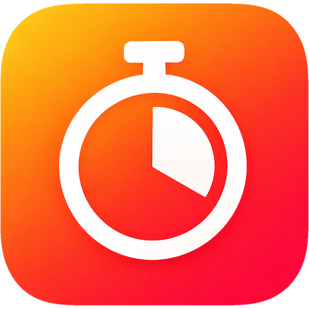
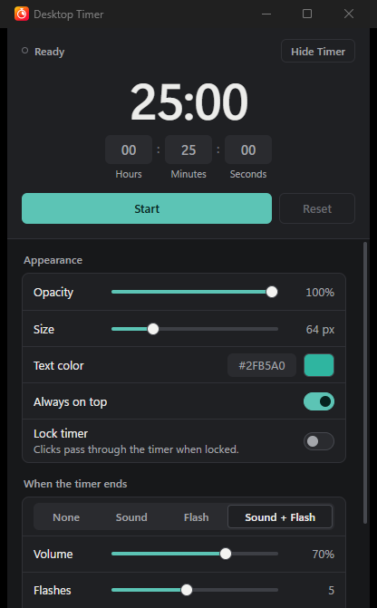
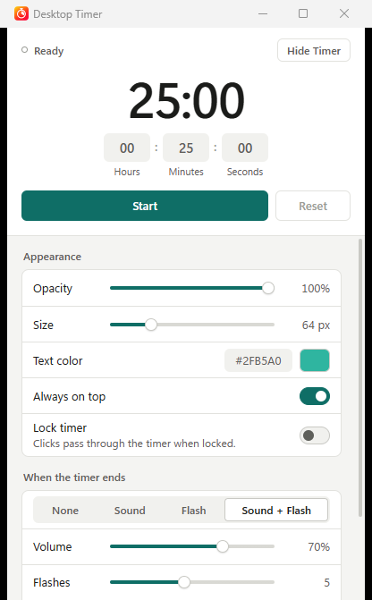
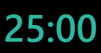

# Desktop Timer



Desktop Timer is a lightweight desktop countdown timer designed to stay unobtrusively visible while you work, study, game, present, or do other tasks. A small floating overlay shows the remaining time, and a separate control window lets you set it up.

**Free for personal, non-commercial use.** See [LICENSE.txt](LICENSE.txt).



## Download

**[Download Desktop Timer 1.0.0 for Windows](https://github.com/Ali-Bhn/desktop-timer/releases/tag/v1.0.0)**

- File: `Desktop-Timer-1.0.0-Windows-x64-Setup.exe`
- Supported platform: Windows 10/11 x64

Release notes are in [RELEASE_NOTES.md](RELEASE_NOTES.md).

## Features

- Floating timer overlay
- Draggable positioning
- Configurable opacity
- Configurable font size
- Configurable timer colour
- Always-on-top option
- Lock / click-through mode
- Start / Pause / Resume / Reset
- Completion sound
- Completion flash
- System tray controls
- Close-to-tray
- Persistent settings
- Light / Dark / System theme (for the control window)

## Screenshots

| Control window (dark) | Control window (light) |
| --- | --- |
|  |  |

Floating timer overlay:



## Requirements

- Windows 10/11 x64
- Microsoft Edge WebView2 Runtime. Desktop Timer uses it through Tauri. Windows 11 includes it. If it is missing, the installer downloads Microsoft's WebView2 bootstrapper during setup, which needs an internet connection once.

## Installation

1. Download `Desktop-Timer-1.0.0-Windows-x64-Setup.exe` from the release page.
2. (Optional) Verify the download, see below.
3. Run the installer and follow the steps.

The installer is a per-user installation, so it does not normally require administrator rights.

**Unsigned software.** The first release of Desktop Timer is not digitally code-signed. Because of this, Windows SmartScreen may show a warning when you run the installer. Whether it appears depends on your Windows settings and on the reputation of the file. Please make your own decision about whether to run unsigned software. Do not turn off Windows Security, SmartScreen or your antivirus software to install Desktop Timer.

## Verify your download (optional)

[CHECKSUMS.txt](CHECKSUMS.txt) lists the SHA-256 checksum of the installer. To check it in PowerShell, run this in the folder with the installer:

```powershell
Get-FileHash .\Desktop-Timer-1.0.0-Windows-x64-Setup.exe -Algorithm SHA256
```

The `Hash` value must match the one in `CHECKSUMS.txt`. If it does not, download the file again.

## Uninstallation

Open **Settings → Apps → Installed apps → Desktop Timer → Uninstall**.

Uninstalling removes the program, its shortcuts and its uninstall entry. Your settings are kept by default, so they are still there if you reinstall. The uninstaller has an unticked option, "Delete the application data", that also removes them.

## Privacy

Desktop Timer does not include accounts, cloud synchronization, analytics, or application telemetry. Settings are stored in a local file on your computer. The Microsoft Edge WebView2 Runtime that Desktop Timer relies on is a separate Microsoft component and may do its own network activity.

## Platforms

Windows 10/11 x64 is the only platform released so far. macOS is planned but has not been validated.

## License

Desktop Timer is proprietary software, free for personal, non-commercial use. You may not sell it, redistribute it commercially, repackage it, or distribute modified builds. The full terms are in [LICENSE.txt](LICENSE.txt).
